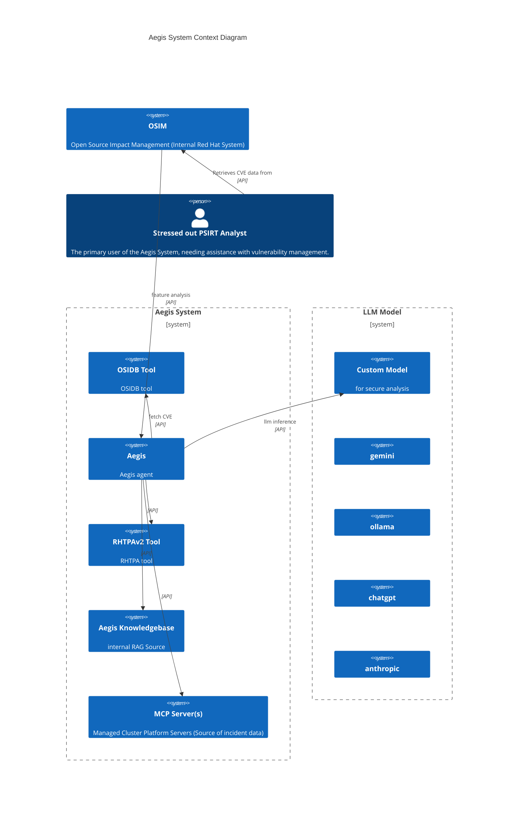

#  Aegis - Red Hat Product Security Agent

[](https://github.com/RedHatProductSecurity/aegis/actions/workflows/tests.yml)

**Note: undergoing disruptive development to get to first release - 'here be dragons'**

**Note: As Aegis is an agent - be careful of which llm model you use ... if you want to integrate with OSIDB/RHTPA, you MUST use a secure model**

## Overview

**Aegis enables security teams to leverage the latest Generative AI models for enhanced security analysis.** Integrate your preferred LLM (ChatGPT, Anthropic, Gemini, or even a local model) to quickly perform deep security analysis on critical artifacts like **CVEs, advisories, and more**.

Aegis helps by:

* **Accelerate Analysis:** Insights into complex security data.
* **Improve Accuracy:** Augment LLM capabilities with in-context security information.
* **Enhance Efficiency:** Automate repetitive analysis tasks, working on security entities (ex. CVE) to focus on higher-value work.

---

## Features

Aegis features address common product security needs:

### CVE Analysis

* **Suggest Impact:** Get an in context LLM-driven suggestion for a CVE's overall impact.
* **Suggest CWE:** Get an in context LLM-driven Common Weakness Enumeration (CWE) mappings for CVE.
* **Suggest CVSS:** Get an in context LLM-driven Common Vulnerability Scoring System (CVSS) score.
* **Identify PII:** Automatically detect and flag Personally Identifiable Information within security texts.
* **Rewrite Security Text:** Rephrase or refine security advisories and descriptions for clarity or specific audiences.
* **CVSS Diff Explainer:** Understand  differences between Red Hat and NVD CVSS scores with AI-generated explanations.

### Component Intelligence

* **Component Intelligence:** Generate a component 'card' of information.

## Context

Feature analysis requires 'context' beyond that contained by any specific llm model. 

We provide 'out of the box' integrations with the following:

* [OSIDB](https://github.com/RedHatProductSecurity/osidb) 
* [RHTPAv2](https://github.com/trustification/trustify)

which perform lookups on security entities (ex. CVE).

For adhoc context - we provide a simple knowledgebase, built on:
* [postgres](https://www.postgresql.org/)
* [pgvector](https://github.com/pgvector/pgvector)

which we can ingest additional general facts and documents, which are then used to enhance context on all AI feature 
analysis.

Aegis can also be an [MCP](https://modelcontextprotocol.io/introduction) client to integrate (providing further tooling/context)
with any compliant MCP servers.

---

## Quick Start

**Note**: Eventually we will have a proper package on pypi.

First ensure `Aegis` can use any required ca certs:
```commandline
REQUESTS_CA_BUNDLE="/etc/pki/tls/certs/ca-bundle.crt"
```

### Connecting to LLMs

Aegis allows you to connect to various LLM providers, from your own custom models to cloud LLM services and MaaS.

**Using Aegis with Local Ollama:**
Configure Aegis to use a locally running Ollama instance:

```bash
export AEGIS_LLM_HOST=http://localhost:11434
export AEGIS_LLM_MODEL=llama3.2:3b
# Ensure Ollama is running and 'llama3.2' model is pulled
```

**Using Aegis with Anthropic:**
Connect to Anthropic's powerful Claude models (replace `ANTHROPIC_API_KEY` with your actual key):

```bash
export AEGIS_LLM_HOST="https://api.anthropic.com"
export AEGIS_LLM_MODEL="anthropic:claude-3-5-sonnet-latest"
export ANTHROPIC_API_KEY="YOUR_ANTHROPIC_API_KEY"
```
**Note:** For other LLM providers (e.g., OpenAI, Google Gemini), similar environment variables will be used. Refer to the `DEVELOP.md` for environment var information.

Be aware that Aegis is an agent (which autonomously invokes tools) so any llm model you use must be secure/trusted.

### Setting up Aegis Tools

Aegis provides a few 'out of the box' tools that the agent can use to enhance llm query context.

#### OSIDB

Integration with OSIDB is achieved via [osidb-bindings](https://github.com/RedHatProductSecurity/osidb-bindings), set
OSIDB server url for Aegis with:
```bash
export AEGIS_OSIDB_SERVER_URL="https://osidb.prodsec.redhat.com"
```

Uses kerberos built in auth with `osidb-bindings`.

#### RHTPA

TBA

### Setting up the RAG knowledgebase

To run a local postgres with pgvector - which is used for additional RAG context.
```commandline
cd etc/deploy && podman-compose up --build
```

Once this is running it will be consulted by the Agent for additional context.

---

## Using Aegis Features

`Aegis` features can be invoked programmatically via Python, through its built-in Command-Line Interface (CLI), or exposed via a REST API.

### Command-Line Interface (CLI)

Run features directly from your terminal using the CLI:

```bash
uv run aegis suggest-impact "CVE-2025-5399"
```

### Programmatic Usage (Python)

First install required dependencies:

```commandline
uv sync 
```

The following programmatically invokes the `SuggestImpact` feature:

```python
import asyncio
from aegis.agents import feature_agent
from aegis.features import cve 

async def main():
    feature = cve.SuggestImpact(feature_agent)
    result = await feature.exec("CVE-2025-0725")
    print(result.output.model_dump_json(indent=2))

if __name__ == "__main__":
    asyncio.run(main())
```

Which produces JSON output:

```json
{
  "cve_id": "CVE-2025-0725",
  "title": "Buffer Overflow in libcurl via zlib Integer Overflow",
  "components": [
    "libcurl"
  ],
  "explanation": "This vulnerability is assessed as LOW impact for the following reasons:\n\n1. The statement explicitly indicates \"This CVE is not applicable to any supported version of Red Hat Enterprise Linux sinc RHEL-4\"\n2. The vulnerability only affects systems using zlib 1.2.0.3 or older, which is an extremely outdate version\n3. While the vulnerability type (buffer overflow via integer overflow) could potentially be serious, the specific conditions required make this unlikely to affect any supported Red Hat products\n4. The attack requires specific conditions: libcurl must be configured to use automatic gzip decompression with CURLOPT_ACCEPT_ENCODING and must be using the vulnerable zlib version\n\nGiven that this affects only legacy, unsupported versions and configurations, the real-world impact on Red Hat customers is minimal.",
  "confidence": 0.95,
  "impact": "LOW"
}
```

### REST API Server

You can also accesss all features from the example fastapi based REST API server:

```bash
uv run uvicorn src.aegis_restapi.main:app --port 9000
```
Once running - interact with the API via HTTP - for example: `http://localhost:9000/api/v1/cve/suggest/impact/CVE-2025-0725`). 

---
## System Overview
System context diagram for Aegis.


