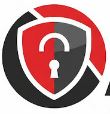

#  Aegis - Red Hat Product Security Agent

[](https://github.com/RedHatProductSecurity/aegis/actions/workflows/tests.yml)

**Note: undergoing disruptive development to get to first release - 'here be dragons'**

**Note: As Aegis is an agent - be careful of which llm model you use ... if you want to integrate with OSIDB/RHTPA, you should use a secure model**

## Overview

**Aegis enables security teams to leverage the latest Generative AI models for enhanced security analysis.** Integrate your preferred LLM (ChatGPT, Anthropic, Gemini, or even a local model) to quickly perform deep security analysis on critical artifacts like **CVEs, advisories, and more**.

Aegis streamlines the process, helping you:

* **Accelerate Analysis:** Insights into complex security data.
* **Improve Accuracy:** Augment LLM capabilities with in-context security information.
* **Enhance Efficiency:** Automate repetitive analysis tasks to focus on higher-value work.

---

## Features

Aegis offers specialized "Features" designed to address common product security needs:

### CVE Analysis

* **Suggest Impact:** Get an in context LLM-driven suggestion for a CVE's overall impact.
* **Suggest CWE:** Get an in context LLM-driven Common Weakness Enumeration (CWE) mappings for CVE.
* **Suggest CVSS:** Get an in context LLM-driven Common Vulnerability Scoring System (CVSS) score.
* **Identify PII:** Automatically detect and flag Personally Identifiable Information within security texts.
* **Rewrite Security Text:** Rephrase or refine security advisories and descriptions for clarity or specific audiences.
* **CVSS Diff Explainer:** Understand  differences between Red Hat and NVD CVSS scores with AI-generated explanations.

### Component Intelligence

* **Component Intelligence:** Gain insights and context about software components.

## Context

Feature analysis requires 'context' beyond that supplied by any specific llm model. We provide 'out of the box' integrations
with the following:

* [OSIDB](https://github.com/RedHatProductSecurity/osidb) 
* [RHTPAv2](https://github.com/trustification/trustify)

which perform lookups on security entities (ex. CVE).

For more adhoc context - we provide a simple knowledgebase, built on:
* [postgres](https://www.postgresql.org/)
* [pgvector](https://github.com/pgvector/pgvector)

which provides the ability to ingest general facts and documents, which can then be used to enhance context on all feature 
analysis.

Aegis provides [MCP](https://modelcontextprotocol.io/introduction) integration as well.

---

## Quick Start & Usage

Aegis allows you to connect to various LLM providers, from cloud services to secure local models.

Note: Eventually we will have a proper package on pypi.

Ensure Aegis can use any required ca certs:
```commandline
REQUESTS_CA_BUNDLE="/etc/pki/tls/certs/ca-bundle.crt"
```

### Connecting to LLMs

**Using Aegis with Local Ollama:**
Configure Aegis to use a locally running Ollama instance:

```bash
export AEGIS_LLM_HOST=http://localhost:11434
export AEGIS_LLM_MODEL=llama3.2:3b
# Ensure Ollama is running and 'llama3.2' model is pulled
```

**Using Aegis with Anthropic:**
Connect to Anthropic's powerful Claude models (replace `ANTHROPIC_API_KEY` with your actual key):

```bash
export AEGIS_LLM_HOST="https://api.anthropic.com"
export AEGIS_LLM_MODEL="anthropic:claude-3-5-sonnet-latest"
export ANTHROPIC_API_KEY="YOUR_ANTHROPIC_API_KEY"
```
**Note:** For other LLM providers (e.g., OpenAI, Google Gemini), similar environment variables will be used. Refer to the `DEVELOP.md` for environment var information.

### Connecting to Tools

#### OSIDB

Integration with OSIDB is achieved via [osidb-bindings](https://github.com/RedHatProductSecurity/osidb-bindings), set
OSIDB server url for Aegis with:
```bash
export AEGIS_OSIDB_SERVER_URL="https://osidb.prodsec.redhat.com"
```

### Setup RAG knowledgebase

To run a local postgres with pgvector - which is used for additional RAG context.
```commandline
cd etc/deploy && podman-compose up --build
```

### Invoking an Aegis Feature

Aegis features can be invoked programmatically via Python, through its built-in Command-Line Interface (CLI), or exposed via a REST API.

#### Programmatic Usage (Python)

Here's an example demonstrating how to get an impact suggestion for a CVE:

Install any dependencies:

```commandline
uv sync 
```

```python
import asyncio
from aegis.agents import feature_agent
from aegis.features import cve 

async def main():
    feature = cve.SuggestImpact(feature_agent)
    result = await feature.exec("CVE-2022-12345")
    print(result.output.model_dump_json(indent=2))

if __name__ == "__main__":
    asyncio.run(main())
```

This will produce structured JSON output, like this:

```json
{
  "cve_id": "CVE-2025-5399",
  "title": "WebSocket endless loop",
  "components": [
    "curl"
  ],
  "explanation": "explanation contains rationale for suggested impact",
  "confidence": 0.85,
  "impact": "LOW"
}
```

#### Command-Line Interface (CLI)

Run features directly from your terminal:

```bash
uv run aegis suggest-impact "CVE-2025-5399"
```

which should also install any required dependencies.

#### REST API Server

For integration with other services, you can run Aegis as a local REST API server:

```bash
uv run uvicorn src.aegis_restapi.main:app --port 9000
```
Once running, you can interact with the API (e.g., `http://localhost:9000/api/v1/cve/suggest/impact/CVE-2022-12345`). 