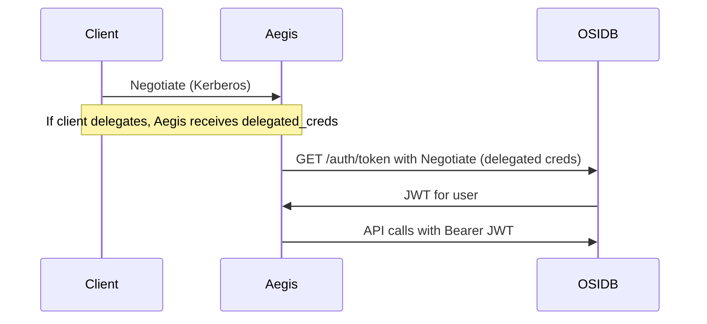

# Kerberos Delegation for Aegis Web API

When the Aegis web API uses Kerberos authentication with credential delegation, it can call OSIDB on behalf of the authenticated user (pass-through auth). This enables OSIDB-backed features like suggest-impact to use the requester's identity instead of the service account.

## Why Delegation Is Needed



Aegis sits between the client and OSIDB. To call OSIDB as the authenticated user, the client must **delegate** its Kerberos credentials to Aegis so Aegis can obtain an OSIDB JWT for that user.

Delegation is **client-initiated** in GSS-API: the client must request delegation when establishing the security context. The server cannot force it.

## Prerequisites

- **Forwardable ticket**: Use `kinit -f` to obtain a forwardable TGT. Without this, the KDC will not issue delegated credentials.
- **KDC configuration**: The Aegis service principal (e.g. `HTTP/aegis-stage.example.com`) may need the `OK-AS-DELEGATE` flag in the KDC so the client's KDC allows delegation to Aegis. Consult your Kerberos administrator.

## Client Options

### Firefox (browser users)

Firefox supports credential delegation via `network.negotiate-auth.delegation-uris`.

1. Navigate to `about:config` in the address bar.
2. Add the Aegis host or domain to `network.negotiate-auth.delegation-uris` (e.g. `https://aegis-stage.example.com` or `.example.com`).
3. Ensure `network.negotiate-auth.trusted-uris` includes the Aegis domain.
4. Run `kinit -f` for a forwardable ticket before visiting the Aegis web UI.

When you authenticate to Aegis, the browser will delegate credentials and the server will use them for OSIDB pass-through auth.

**Security warning**: Delegated credentials are out of your control. Only delegate to servers you trust.

### Chrome / Chromium

Chrome has equivalent Kerberos delegation settings. Configuration depends on deployment:

- **Enterprise**: Use Group Policy or device policy to set `AuthServerWhitelist` and delegation-related policies.
- **Manual**: See [Chrome enterprise documentation](https://support.google.com/chrome/a/answer/2579948) for Kerberos auth and delegation.

### Python with requests-gssapi (CLI / API clients)

For scripted or CLI access, use Python with `requests-gssapi` and `delegate=True`:

```python
import requests
from requests_gssapi import HTTPSPNEGOAuth

resp = requests.post(
    "http://aegis-stage.example.com:9000/api/v1/analysis/cve/suggest-impact",
    auth=HTTPSPNEGOAuth(delegate=True),
    json={"cve_id": "CVE-2026-27521"},
    headers={"Content-Type": "application/json"},
)
```

Prerequisites: `kinit -f` and `requests-gssapi` installed (`pip install requests-gssapi`).

A helper script is also provided:

```bash
uv run python scripts/aegis-api-with-delegation.py POST /api/v1/analysis/cve/suggest-impact '{"cve_id":"CVE-2026-27521"}'
```

### curl (limitation)

`curl --negotiate` does **not** request delegation; that capability was removed for security. There is no curl flag to re-enable it.

For delegation to work, use a browser (with the configuration above) or the Python client with `HTTPSPNEGOAuth(delegate=True)`.

## Verifying Delegation

When delegation works, the Aegis server logs will show:

```
Using delegated Kerberos credentials for OSIDB (pass-through auth)
```

If you see this, OSIDB calls are being made with your identity. Without delegation, the server falls back to process-level OSIDB auth (service account).

## Summary

| Client                 | Delegation support | Action                                       |
| ---------------------- | ------------------ | -------------------------------------------- |
| Firefox                | Yes                | Set `network.negotiate-auth.delegation-uris` |
| Chrome                 | Yes                | Configure equivalent delegation URIs         |
| Python requests-gssapi | Yes                | Use `HTTPSPNEGOAuth(delegate=True)`          |
| curl                   | No                 | Use Python or browser instead                |

## References

- [Configuring Firefox for Negotiate Authentication](https://people.redhat.com/mikeb/negotiate/)
- [Configuring WWW-Negotiate Credentials delegation](http://www.grolmsnet.de/kerbtut/credentialsdelegation.html)
